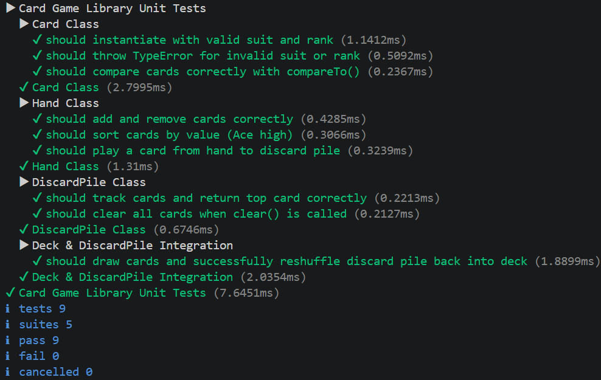

# Test Report
## Summary

test-app.js was created and tests were created and manually confirmed using console outputs.
Unit tests were also generated using AI tools in test/DeckLib.test.js.

## Test Results

| What was tested | How it was tested | Result |
| ---------------- | ------------------ | ------- |
|   Shuffled and unshuffled deck instantiates correctly                |       Tested manually via test-app.js and confirming with console outputs             |  Passed       |
|      deck.draw()and deck.drawmultiple() move the correct cards             |   Tested manually via test-app.js and confirming with console outputs                 |    Passed     |
|   Hand correctly tracks cards and is able to sort these in ascending order via sortByValue                |  Tested manually via test-app.js and confirming with console outputs                  |    Passed     |
|   Deck.draw() correctly throws an error when attempting to draw from an empty deck              |    Tested manually via test-app.js and confirming with console outputs                |    Passed     |
|     DiscardPile correctly tracks played cards and can be reshuffled into the deck              |      Tested manually via test-app.js and confirming with console outputs              |   Passed      | Tested manually via test-app.js and confirming with console outputs
| Confirm error for incorrect suits or ranks during instanstiation|Automated unit tests |Passed |
compareto() properly compares cards based on ranks and suits|Automated units tests |Passed |
